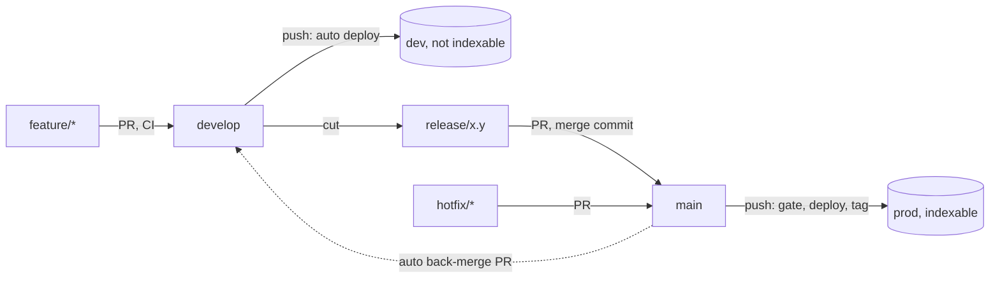

# Delivery

How this site is branched, checked, previewed and released. It follows the Patea standards
(`patea-devops/STANDARDS.md`), a little less strictly: there is no data service, so there is no
staging environment and no schema rule.

| Branch | Deploys to | Notes |
|---|---|---|
| `feature/<issue>-<slug>` | nothing | PR into `develop`. CI runs. |
| `develop` | `dev`: https://dev.jpatrickbeal.com | Smoke tests run after each deploy. Never indexed. |
| `release/x.y` | nothing | Cut from `develop`. Fixes only. PR into `main`. |
| `hotfix/<slug>` | nothing | Branch from `main`, PR into `main`. |
| `main` | `prod`: https://jpatrickbeal.com | Merging deploys and tags `vX.Y.Z`. |

Nobody pushes to `main` or `develop`. Every change arrives by pull request.

## Day to day

- **Ship a change.** Branch `feature/<issue>-<slug>` from `develop`, open a PR into `develop`, merge with
  **squash** when CI is green. It deploys to dev on its own. Check it there.
- **Release.** Branch `release/x.y` from `develop`, open a PR into `main` with the release template
  (`?template=release.md`), and merge with a **merge commit**. The prod gate refuses a squashed release.
- **Hotfix.** Branch `hotfix/<slug>` from `main`, PR into `main`, merge. Nothing verifies it on dev first, so
  keep it small.
- **Roll back.** Run the Roll back prod workflow with the previous release tag.

Merge methods: squash for `feature/*` into `develop`; merge commit for `release/*` into `main` and for the
back-merge; either for a hotfix. Branches delete themselves when their PR merges, so never use `develop`
as a PR's head branch.

## Environments

| | dev | prod |
|---|---|---|
| URL | https://dev.jpatrickbeal.com | https://jpatrickbeal.com |
| Worker | `patrick-beal-dev` | `patrick-beal` |
| Built with | `SITE_ENV=dev` | `SITE_ENV=prod` |
| Indexable | No | Yes |

Only `SITE_ENV=prod` makes a build indexable. Anything else (dev, a local build, a forgotten variable) is
not. A non-prod build is blocked three ways: an `X-Robots-Tag: noindex` response header (`_headers`, written
by the Astro config), a `<meta name="robots">` tag (`Base.astro`) and `Disallow: /` in `robots.txt`.
`scripts/smoke.sh` asserts all three on dev and the opposite on prod after every deploy. The default
`*.workers.dev` URL is switched off in `wrangler.jsonc`, so nothing is served from it.

If dev should be private and not only unindexed, put a Cloudflare Access application (Zero Trust, free
for up to 50 users) in front of `dev.jpatrickbeal.com`. It would block the smoke test, so add a service
token to the smoke script first.

## What is enforced

This repo is public, so GitHub rulesets are available on the Free plan, which they are not for private
repos. The deploy checks still apply as a backstop.

| Rule | Enforced by |
|---|---|
| Nobody pushes to `main` or `develop`; CI must pass | A ruleset on each branch (set up once, below) |
| PRs target the right branch | `ci.yml` `target` job, a red X on the PR |
| Prod ships only a merged release or hotfix PR, never a squashed release | `verify-promotion`, which refuses the deploy |
| Only `develop` can read the dev token, only `main` the prod token | GitHub environment branch restrictions |
| Only `main` code can run the rollback gate; the tag must be on `main` | `rollback.yml` checks out `main`, verifies, then the tag |
| Third-party actions can't change under us | Pinned to commit SHAs (Renovate keeps them current) |
| Fork PRs get no secrets | Workflows use `pull_request`, never `pull_request_target` |

### Deviations from the Patea standards

- **No staging.** `release/x.y` does not deploy anywhere. The release is verified on dev, because it is
  cut from `develop`. `verify-promotion` therefore skips the staging-deployment check.
- **Deploy token is a GitHub environment secret, not OIDC.** Cloudflare can't federate with GitHub the way
  AWS can. The `dev` and `prod` environments are limited to their own branch, which does the job of the
  branch-pinned role. Jobs here use `environment:`, which `patea-devops` forbids because its gate reads
  deployment records. This gate does not.
- **Workflows are vendored.** `patea-devops` is private and org-scoped, so a personal repo can't call it.
  `.github/actions/*` and `back-merge.yml` are copies. If `patea-devops` changes the gate, port it.
- **No Vale.** The Patea prose style is not applied to this site's copy.
- **Terraform runs locally.** See `infra/README.md`. A plan in Actions needs credentials, and this repo is public.

## One-time setup

Steps marked **(manual)** need you in a dashboard. Do them in order.

1. **Tooling.** Run `pnpm install`, delete `package-lock.json`, and commit `pnpm-lock.yaml` (CI refuses
   the npm lockfile). The `packageManager` field in `package.json` pins pnpm.
2. **Branches.** Create `develop` from `main`. Set the default merge settings: allow squash and merge
   commit, turn off rebase, turn on "Automatically delete head branches". The API does all of it:
   `gh api -X PATCH repos/jpatrickb/jpatrickb.github.io -F allow_squash_merge=true -F allow_merge_commit=true -F allow_rebase_merge=false -F delete_branch_on_merge=true -f squash_merge_commit_title=PR_TITLE -f squash_merge_commit_message=PR_BODY`
3. **(manual)** Settings, Actions, General: turn on "Allow GitHub Actions to create and approve pull
   requests" (the back-merge needs it) and set fork pull request workflows to "Require approval for all
   outside collaborators".
4. **(manual)** Cloudflare API token: Workers Scripts: Edit, scoped to your account. A second token with the
   Terraform scopes is in `infra/README.md`.
5. **(manual)** Settings, Environments: create `dev` (deployment branches: `develop` only) and `prod`
   (deployment branches: `main` only). Put `CLOUDFLARE_API_TOKEN` in each as an environment secret. Set
   `CLOUDFLARE_ACCOUNT_ID` as a repo variable.
6. **First deploys, by hand.** The custom domains need the Workers to exist, and the smoke test needs the
   domains. Locally, with the token exported: `scripts/deploy.sh dev` and `scripts/deploy.sh prod`.
   Skip the prod deploy if you want the old site to stay current until you cut over.
7. **Domains.** Follow `infra/README.md`: `terraform apply` creates `jpatrickbeal.com`, `dev.jpatrickbeal.com`
   and the `www` redirect.
8. **Rulesets.** Add a tag ruleset that restricts who can create or move `v*` tags (the rollback trusts them). On `main` and `develop`: require a pull request, require the `target` and `checks / site` and
   `checks / infra` status checks, block force pushes and deletion. Ask Claude to apply them with
   `gh api repos/.../rulesets`, or use Settings, Rules.
9. **Cutover.** Merge this work into `develop`, release it to `main`, then delete `.github/workflows/pages.yml`
   so GitHub Pages stops deploying. Check the project links that point at `jpatrickb.github.io/<repo>`.
10. **(manual)** Install the Renovate GitHub App on this repo. `renovate.json` sends its PRs to `develop`.
11. **(manual, after launch)** Add the site in Google Search Console and submit the sitemap when there is one.
