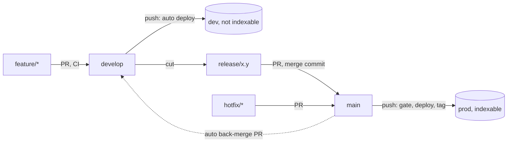

# Delivery

How this site is branched, checked, previewed and released. It follows the Patea standards
(`patea-devops/STANDARDS.md`), a little less strictly: there is no data service, so there is no
staging environment and no schema rule.

| Branch | Deploys to | Notes |
|---|---|---|
| `feature/<issue>-<slug>` | nothing | PR into `develop`. CI runs. |
| `develop` | `dev`: https://dev.jpatrickbeal.com | Smoke tests run after each deploy. Never indexed. |
| `release/x.y` | nothing | Cut from `develop`. Fixes only. PR into `main`. |
| `hotfix/<slug>` | nothing | Branch from `main`, PR into `main`. |
| `main` | `prod`: https://jpatrickbeal.com | Merging deploys and tags `vX.Y.Z`. |

Nobody pushes to `main` or `develop`. Every change arrives by pull request.

## Day to day

- **Ship a change.** Branch `feature/<issue>-<slug>` from `develop`, open a PR into `develop`, merge with
  **squash** when CI is green. It deploys to dev on its own. Check it there.
- **Release.** Branch `release/x.y` from `develop`, open a PR into `main` with the release template
  (`?template=release.md`), and merge with a **merge commit**. The prod gate refuses a squashed release.
- **Hotfix.** Branch `hotfix/<slug>` from `main`, PR into `main`, merge. Nothing verifies it on dev first, so
  keep it small.
- **Roll back.** Run the Roll back prod workflow with the previous release tag.

Merge methods: squash for `feature/*` into `develop`; merge commit for `release/*` into `main` and for the
back-merge; either for a hotfix. Branches delete themselves when their PR merges, so never use `develop`
as a PR's head branch.

## Environments

| | dev | prod |
|---|---|---|
| URL | https://dev.jpatrickbeal.com | https://jpatrickbeal.com |
| Worker | `patrick-beal-dev` | `patrick-beal` |
| Built with | `SITE_ENV=dev` | `SITE_ENV=prod` |
| Indexable | No | Yes |

Only `SITE_ENV=prod` makes a build indexable. Anything else (dev, a local build, a forgotten variable) is
not. A non-prod build is blocked three ways: an `X-Robots-Tag: noindex` response header (`_headers`, written
by the Astro config), a `<meta name="robots">` tag (`Base.astro`) and `Disallow: /` in `robots.txt`.
`scripts/smoke.sh` asserts all three on dev and the opposite on prod after every deploy. The default
`*.workers.dev` URL is switched off in `wrangler.jsonc`, so nothing is served from it.

If dev should be private and not only unindexed, put a Cloudflare Access application (Zero Trust, free
for up to 50 users) in front of `dev.jpatrickbeal.com`. It would block the smoke test, so add a service
token to the smoke script first.

## What is enforced

This repo is public, so GitHub rulesets are available on the Free plan, which they are not for private
repos. The deploy checks still apply as a backstop.

| Rule | Enforced by |
|---|---|
| Nobody pushes to `main` or `develop`; CI must pass; no deleting either | Rulesets on each branch. An admin can bypass only through a pull request, because the automatic back-merge PR can't trigger CI |
| PRs target the right branch | `ci.yml` `target` job, a red X on the PR |
| `main` accepts only merge commits | The `main` ruleset (allowed merge methods), with `verify-promotion` as a backstop |
| Prod ships only a merged release or hotfix PR, never a squashed release | `verify-promotion`, which refuses the deploy |
| Only `develop` can read the dev token, only `main` the prod token | GitHub environment branch restrictions |
| Only `main` code can run the rollback gate; the tag must be on `main` | `rollback.yml` checks out `main`, verifies, then the tag |
| Third-party actions can't change under us | Pinned to commit SHAs (Renovate keeps them current) |
| Fork PRs get no secrets | Workflows use `pull_request`, never `pull_request_target` |

### Deviations from the Patea standards

- **No staging.** `release/x.y` does not deploy anywhere. The release is verified on dev, because it is
  cut from `develop`. `verify-promotion` therefore skips the staging-deployment check.
- **Deploy token is a GitHub environment secret, not OIDC.** Cloudflare can't federate with GitHub the way
  AWS can. The `dev` and `prod` environments are limited to their own branch, which does the job of the
  branch-pinned role. Jobs here use `environment:`, which `patea-devops` forbids because its gate reads
  deployment records. This gate does not.
- **Workflows are vendored.** `patea-devops` is private and org-scoped, so a personal repo can't call it.
  `.github/actions/*` and `back-merge.yml` are copies. If `patea-devops` changes the gate, port it.
- **No Vale.** The Patea prose style is not applied to this site's copy.
- **Terraform runs in CI, with split credentials.** Apply runs in `deploy.yml` with environment secrets that only `develop` and `main` can read. Plans on PRs use separate read-only repo secrets. See `infra/README.md`. Workflow logs are public, so account and zone ids are masked and redacted.

## One-time setup

Done once. Steps marked **(manual)** need you in a dashboard.

1. Branches, merge settings and the `dev` and `prod` environments exist.
2. **(manual)** Actions settings: allow Actions to create and approve pull requests (the back-merge needs it), and
   require approval for fork pull request workflows.
3. Rulesets on `main`, `develop` and `v*` tags are applied (see "What is enforced").
4. **(manual)** Create the Cloudflare tokens, the R2 bucket and the R2 tokens, then add them to GitHub under the
   exact names in `infra/README.md` ("Credentials: the whole list", with click paths and `gh` commands). In short:
   - environment secrets in `dev` and `prod`: `CLOUDFLARE_API_TOKEN`, `CLOUDFLARE_TF_TOKEN`, `R2_ACCESS_KEY_ID`,
     `R2_SECRET_ACCESS_KEY`
   - repository secrets (read-only credentials): `CLOUDFLARE_PLAN_TOKEN`, `R2_PLAN_ACCESS_KEY_ID`,
     `R2_PLAN_SECRET_ACCESS_KEY`
   - repository variables: `CLOUDFLARE_ACCOUNT_ID`, `CLOUDFLARE_ZONE_ID`, `TF_STATE_BUCKET`
5. Merge to `develop`. The deploy publishes the dev Worker, applies the dev domain and smoke-tests it.
6. Cut the first release. The deploy from `main` publishes the prod Worker, applies `jpatrickbeal.com` and the
   `www` redirect, tags `v1.0.0` and smoke-tests prod.
7. Remove `pages.yml` (done) and check the project links that point at `jpatrickb.github.io/<repo>`. The old site
   keeps serving its last build until Pages is turned off or replaced with a redirect.
8. **(manual)** Install the Renovate GitHub App on this repo. `renovate.json` sends its PRs to `develop`.
9. **(manual, after launch)** Add the site in Google Search Console and submit the sitemap when there is one.
